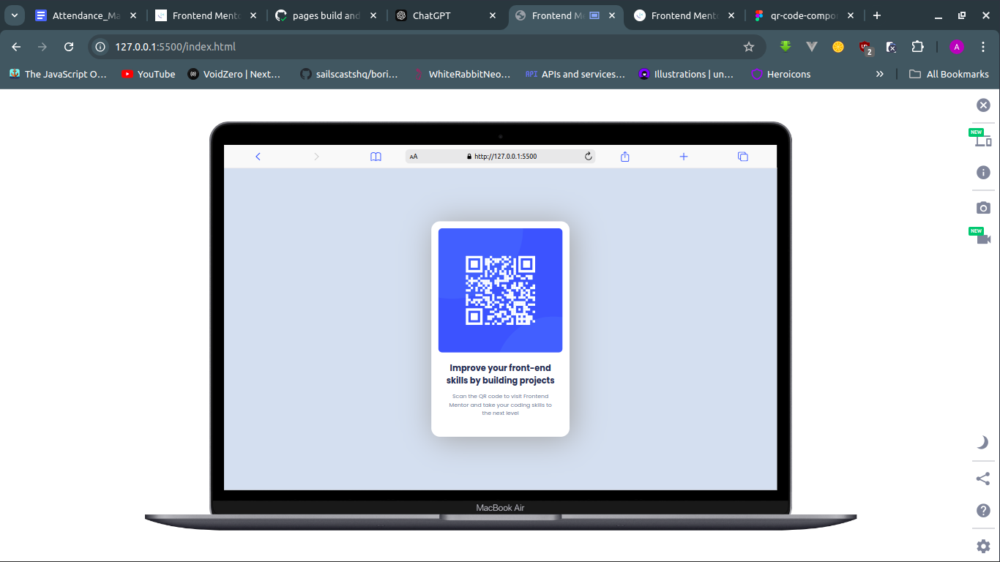

# Frontend Mentor - QR Code Component Solution

This is my solution to the [QR code component challenge on Frontend Mentor](https://www.frontendmentor.io/challenges/qr-code-component-iux_sIO_H). This challenge is a great way to practice building small, real-world projects and improve your HTML and CSS skills.

## Overview

### Screenshot

### Links

- **Live Site URL:** [Visit the live site](https://abdullah4tech.github.io/qr-code-frontendmentor/)

## My Process

### Built with

- Semantic HTML5 markup
- CSS custom properties
- Flexbox for layout

### What I learned

This project helped me practice using Flexbox for centering elements and organizing a simple layout. I also worked on using CSS custom properties for better maintainability. Implementing a responsive design and understanding how to use the `figure` and `img` tags more effectively were part of the learning experience.

### Continued development

In the future, I plan to explore more advanced layouts using CSS Grid and further improve accessibility practices, such as optimizing alt text for images and improving color contrast ratios.

### Useful resources

- [MDN Web Docs on Flexbox](https://developer.mozilla.org/en-US/docs/Learn/CSS/CSS_layout/Flexbox) - This is a comprehensive guide on how to use Flexbox.
- [CSS Tricks on Centering in CSS](https://css-tricks.com/centering-css-complete-guide/) - This helped me understand how to center content easily with CSS.

## Author

- **Frontend Mentor:** [@abdullah4tech](https://www.frontendmentor.io/profile/abdullah4tech)
- **Twitter:** [@abdullah4tech](https://www.twitter.com/abdullah4tech_)
